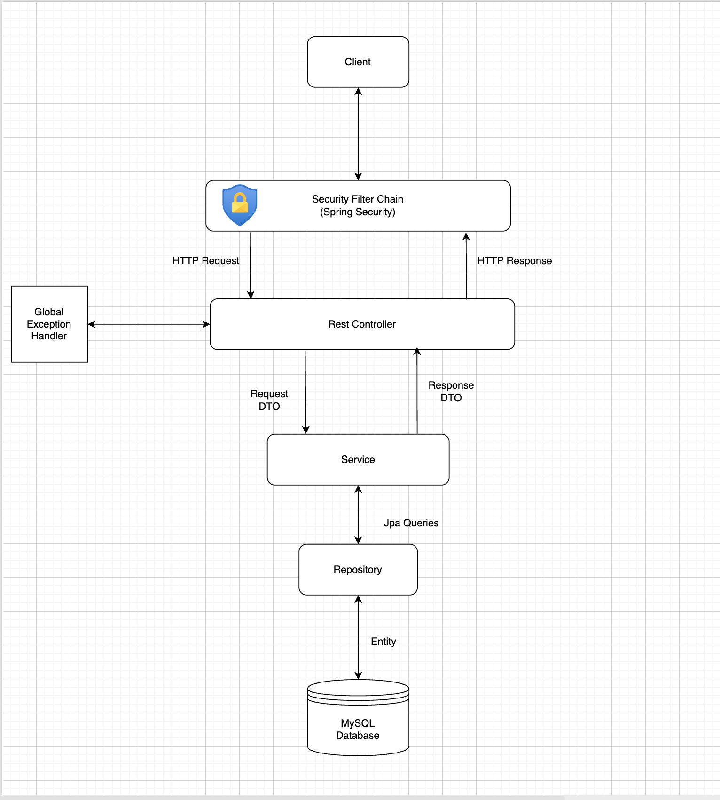
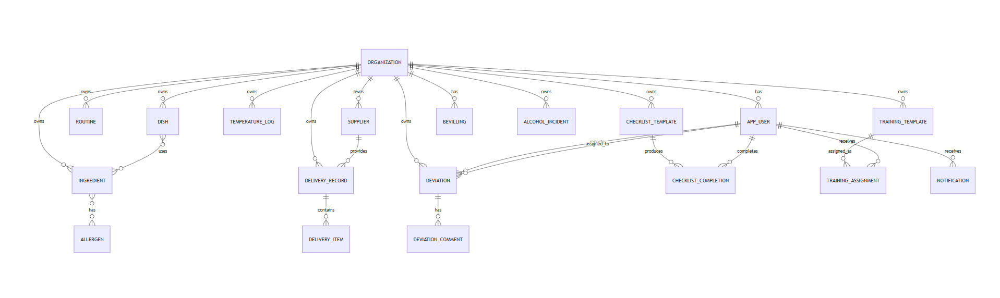

# CheckMate Backend

CheckMate is a full-stack application developed with Vue.js and Spring Boot. The project was developed as the final assessment in the course IDATT2105 Fullstack-Applikasjonsutvikling for the spring semester of 2026 at NTNU.

The backend in this repository is the Spring Boot API for the platform. It handles authentication, authorization, business logic, persistence, notifications, invitations, and administrative workflows for the CheckMate frontend in the companion repository: [fullstack_frontend](https://github.com/scott-dp/fullstack_frontend).

## What The Project Does

CheckMate is designed to help hospitality businesses structure and document internal control work across two main domains:

- `IK-Mat` for food-safety and hygiene follow-up
- `IK-Alkohol` for alcohol-related compliance and responsible service

The backend supports both operational workflows and management functionality. Core functionality includes:

- Secure login: users can securely register, log in, verify email, use one-time login codes, and update account details.
- Internationalization support: the frontend consumes backend functionality in a multilingual application with English, Norwegian, Spanish, Nepali, and Urdu support.
- Role-based access control: the API enforces permissions for staff, manager, admin, and superadmin roles.
- Organization handling: organizations can be created and managed, with org-scoped admins and platform-level superadmin oversight.
- Organization invites: admins can invite users into their organization with token-based flows.
- Routines and checklists: the system stores routine definitions, checklist templates, checklist completion, and checklist history.
- Temperature logging: temperature readings and alerts can be registered and reviewed.
- Deviations and alcohol incidents: non-compliance events can be reported, assigned, commented on, and resolved.
- Suppliers, deliveries, and traceability: the backend supports supplier records, delivery management, and traceability search.
- Dishes, ingredients, and allergens: ingredients can be mapped to allergens, dishes can derive allergen information, and allergen approval workflows are supported.
- Training: training templates can be created, assigned to users, completed, and followed up over time.
- Alcohol license functionality: the API supports alcohol license information and condition tracking used by the frontend.
- Admin functionality: organization admins can manage their own users and administrative processes.
- Superadmin functionality: a global superadmin can create organizations, invite org admins, and manage the platform across organizations.

## Repository Link

- Frontend repository: [fullstack_frontend](https://github.com/scott-dp/fullstack_frontend)

## Tech Stack

- Java 21
- Spring Boot
- Spring Security
- Spring Data JPA
- Spring Validation
- Spring Mail
- JWT authentication
- MySQL
- H2
- Maven
- JaCoCo

## Database Stack

The backend uses different database configurations depending on the environment:

- Production: MySQL, configured in [application-prod.properties](C:\Users\scott\Documents\data\6.semester\fullstack\frivillig\backend\fullstack-project\src\main\resources\application-prod.properties)
- Development: H2 in-memory database, configured in [application-dev.properties](C:\Users\scott\Documents\data\6.semester\fullstack\frivillig\backend\fullstack-project\src\main\resources\application-dev.properties)
- Test: H2 in-memory database, configured in [application-test.properties](C:\Users\scott\Documents\data\6.semester\fullstack\frivillig\backend\fullstack-project\src\main\resources\application-test.properties)

The active profile is controlled through `SPRING_PROFILES_ACTIVE`, with `dev` as the default profile in [application.properties](C:\Users\scott\Documents\data\6.semester\fullstack\frivillig\backend\fullstack-project\src\main\resources\application.properties).

## Running The Backend

### Prerequisites

- Java 21
- Maven, or the included Maven Wrapper

### Run In Development

Windows:

```powershell
.\mvnw.cmd spring-boot:run
```

macOS/Linux:

```bash
./mvnw spring-boot:run
```

By default, the backend runs with the `dev` profile and listens on port `8080`.

### Build A Package

Windows:

```powershell
.\mvnw.cmd package -DskipTests
```

macOS/Linux:

```bash
./mvnw package -DskipTests
```

## Testing

### Run Tests

Windows:

```powershell
.\mvnw.cmd test
```

macOS/Linux:

```bash
./mvnw test
```

### Run Full Verification With Coverage

Windows:

```powershell
.\mvnw.cmd verify
```

macOS/Linux:

```bash
./mvnw verify
```

### Generate Javadocs

Windows:

```powershell
.\mvnw.cmd javadoc:javadoc
```

macOS/Linux:

```bash
./mvnw javadoc:javadoc
```

## Important Configuration

Some important backend configuration values are defined through environment variables, including:

- `SPRING_PROFILES_ACTIVE` (doesn't need to be set)
- `SERVER_PORT` (doesn't need to be set)
- `APP_FRONTEND_URL` (doesn't need to be set if running dev or test profiles)
- `JWT_SECRET` (doesn't need to be set)
- `JWT_ACCESS_TOKEN_EXPIRATION` (doesn't need to be set)
- `SPRING_DATASOURCE_URL` (doesn't need to be set if running dev or test profiles)
- `SPRING_DATASOURCE_USERNAME` (doesn't need to be set if running dev or test profiles)
- `SPRING_DATASOURCE_PASSWORD` (doesn't need to be set if running dev or test profiles)
- `MAIL_HOST` (doesn't need to be set if using gmail)
- `MAIL_PORT` (doesn't need to be set)
- `MAIL_USERNAME` (needs to be set to a gmail you have an app password for)
- `KRISEFIKSER_EMAIL_PASSWORD` (needs to be set to the app password for the gmail you use)

## Deployment To The VM

The production backend is deployed to a VM through GitHub Actions CD and a self-hosted runner. 
The deployed app can be found at https://idatt2105-20.idi.ntnu.no/

### Deployment Flow

1. A push to the `master` branch triggers [.github/workflows/cd.yml](C:\Users\scott\Documents\data\6.semester\fullstack\frivillig\backend\fullstack-project\.github\workflows\cd.yml).
2. The workflow runs on a GitHub self-hosted runner located on the VM.
3. The runner calls `/home/student/deployment/deploy.sh`.
4. On the VM, the backend deployment is handled through Docker Compose.
5. The backend runs with the production profile and connects to MySQL in production.

### CI

Pull requests trigger [.github/workflows/ci.yml](C:\Users\scott\Documents\data\6.semester\fullstack\frivillig\backend\fullstack-project\.github\workflows\ci.yml), which:

- runs the Maven verification step
- generates coverage
- builds the backend package
- generates Javadocs
- uploads coverage, Javadocs, and test reports

### Production Runtime

The VM deployment uses Docker Compose for the backend stack. In the production setup described by the workflow and deployment process, Docker Compose is responsible for starting and managing the backend container together with the production database and related services.

## API And Documentation

The backend exposes API documentation through Springdoc OpenAPI:

- Swagger UI: https://idatt2105-20.idi.ntnu.no/swagger-ui/index.html#/
- OpenAPI JSON: https://idatt2105-20.idi.ntnu.no/v3/api-docs

## Project Structure

Key backend areas include:

- controllers for HTTP endpoints
- services for business logic
- repositories for persistence
- entities and DTOs
- security and JWT handling
- notification and invitation flows
- seeding and environment configuration

## System Architecture




Simplified ER diagram of the CheckMate backend data model. Organization is the central
tenant entity, while users, operational compliance data, food management, training,    
supplier traceability, and alcohol-license data are all scoped to an organization.
## Credentials

The given staff, manager and admin accounts belong to the organization Everest Fusion & Sushi

Staff user credentials:
 - Username: staff
 - Password: staff123

Manager user credentials:
 - Username: manager
 - Password: manager123

Admin user credentials:
 - Username: admin
 - Password: admin123

The only superadmin account credentials:
 - Username: superadmin
 - Password: superadmin123
